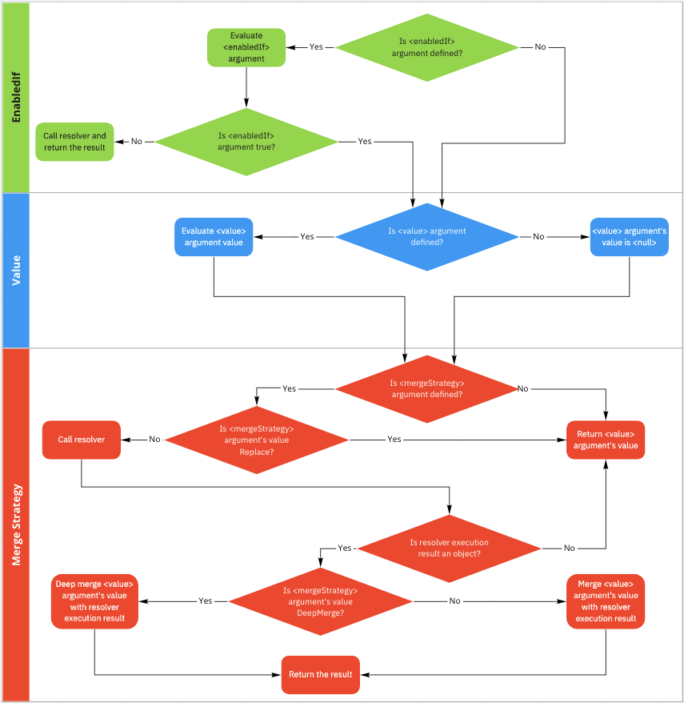

# @localResolver Directive

## General

`@localResolver` lets you create a stub resolver, but make no mistake - this can be used with full parameter injection syntax to create complex resolvers.

The optional `mergeStrategy` parameter allows choosing between replacing/merging/deep merging with the existing resolver value for the field. The `Replace` strategy is used by default.

Full parameters:

```graphql
enum LocalResolverMergeStrategy {
    Replace
    Merge
    MergeDeep
}

directive @localResolver(
    value: JSON!
    mergeStrategy: LocalResolverMergeStrategy = Replace
    enabledIf: Boolean = "{ true }"
)
```

## Arguments

- `value`: (object, optional, default `null) - object or string that may be evaluated using [Argument injection mechanism](../arguments_injection.md). This value will be returned instead of resolver execution or will be merged with it.
- `mergeStrategy`: (enum, optional, default `Replace`) - defines if the resolver won't be executed or its execution result will be merged with the `value`.
- `enabledIf`: (string, optional, default `true`) string that is evaluated using [Argument injection mechanism](../arguments_injection.md). If its value is false the directive will execute the resolver and return its result.

## Examples

Example of replacing the existing resolver value:

```graphql
type Query {
  isAlive: Boolean @localResolver(value: true)
  jsonEcho(input: JSON!): JSON @localResolver(value: { wrapper: "{args.input}" })
}

type User {
  firstName: String!
  lastName: String!
  fullName: String! @localResolver(value: "{source.firstName} {source.lastName}")
}
```

Example of merging with the existing resolver value:

```graphql
type User {
    firstName: String!
    lastName: String!
    fullName: String // not supplied by the resolver
}

type Query {
    getUser: User! @localResolver(value: { fullName: "${source.firstName} ${source.lastName}" }, mergeStrategy: Merge)
}
```

The optional `enabledIf` parameter allows ignore the `value` if its content is evaluated to `false`.
For example:

```graphql
type Foo {
  bar: String! @localResolver(enabledIf: "{!source.bar}", value: "N/A")
}
```

In this case if the `source` object doesn't have `bar` property or it's null or undefined the field value will be `"N/A"`. Otherwise it will be the result of the original field resolver.
When the `mergeStrategy` is set to `Merge` or `MergeDeep` the original resolver result and the `value` parameter evaluation will be merged only if the `enabledIf` is true. Otherwise the field value will be the result of the original field resolver.

## Flow Diagram


